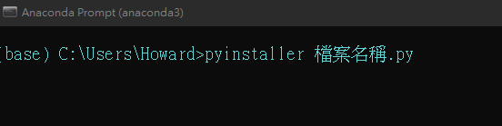
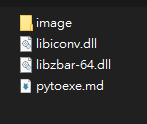
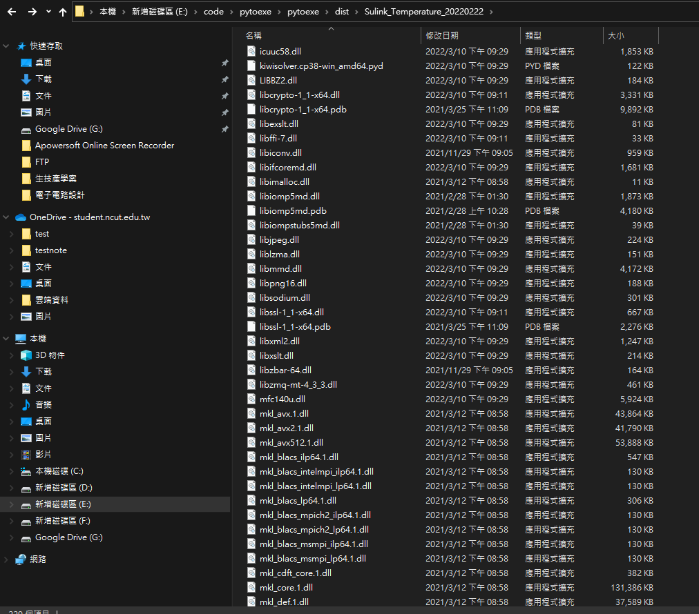

# pyinstaller打包檔案方式
## 開啟需打包的檔案的檔案位置
## 在anaconda或cmd輸入指令(需先安裝pyinstaller)
安裝pyinstaller指令
```py
pip install pyinstaller
```
打包檔案
```py
pyinstaller "檔案名稱"
```

## 當檔案打包完後將檔案還無法使用是因為缺少兩個動態連結檔案



將資料夾下的libiconv.dll和libzbar-64.dll放入dist資料夾下


## (4)重新開起exe檔案便可以成功使用

# SuLink RS15-C 4-Channel PT100 Temperature Transmitter Isolation Acquisition Module

The SuLink RS15-C is a 4-channel PT100 temperature transmitter isolation acquisition module that supports the RS485 interface and follows the MODBUS communication protocol. Below is an introduction to its features and functionalities:

## Features

1. **Multi-Channel Temperature Acquisition**: The RS15-C supports 4 PT100 temperature sensors, enabling simultaneous acquisition of multiple temperature readings.
2. **High-Precision Temperature Measurement**: With PT100 platinum resistance sensors, it provides high-accuracy temperature measurements suitable for industrial-grade requirements.
3. **Isolation Design**: Equipped with an isolation design, it ensures excellent electrical isolation, enhancing system stability and safety.
4. **RS485 Interface**: Utilizes the RS485 communication interface, supporting long-distance communication and multi-point connections, ideal for industrial environments.
5. **MODBUS Communication Protocol**: Adheres to the MODBUS protocol, enabling seamless data communication and control.

## Functions

1. **Temperature Monitoring**: The RS15-C collects temperature data through PT100 sensors and transmits it to upper-level devices or monitoring systems via the RS485 interface.
2. **Isolation Protection**: The module features isolation design to prevent electrical interference and ensure system safety.
3. **Protocol Support**: Supports the MODBUS communication protocol for efficient data exchange and control with other devices.

The SuLink RS15-C 4-Channel PT100 Temperature Transmitter Isolation Acquisition Module is widely applicable in industrial automation, environmental monitoring, and temperature control. It offers a high-precision, stable, and reliable solution for temperature monitoring.

> **Note**: For detailed product specifications and application details, please refer to the official documentation and materials from SuLink.
